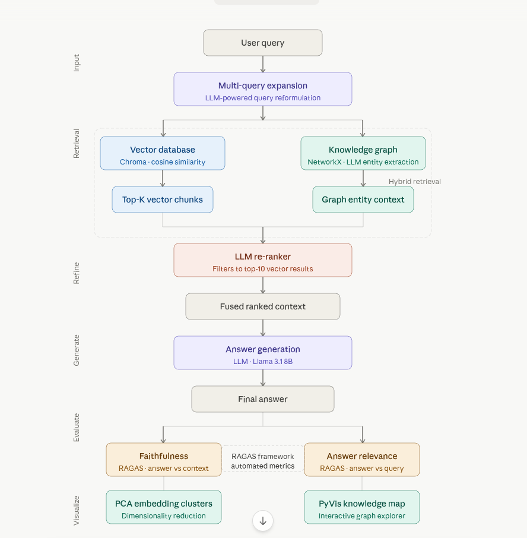
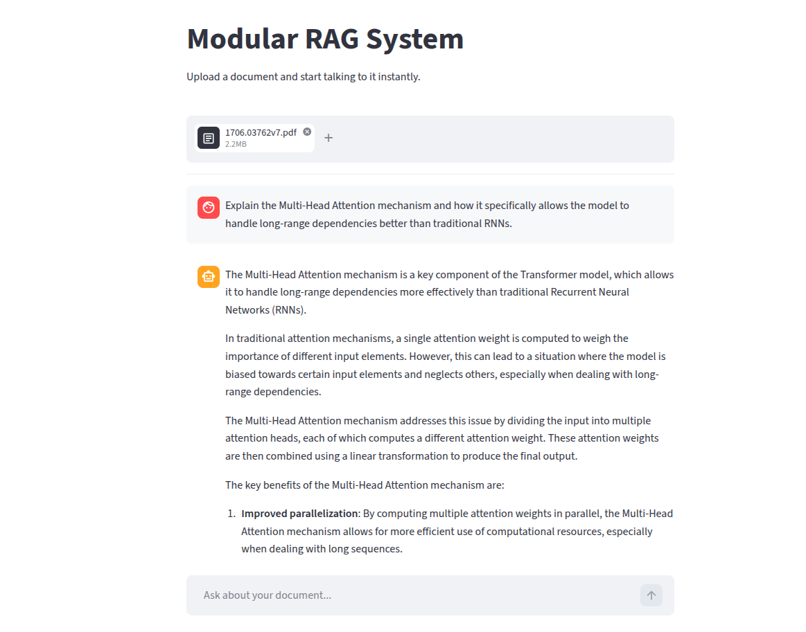
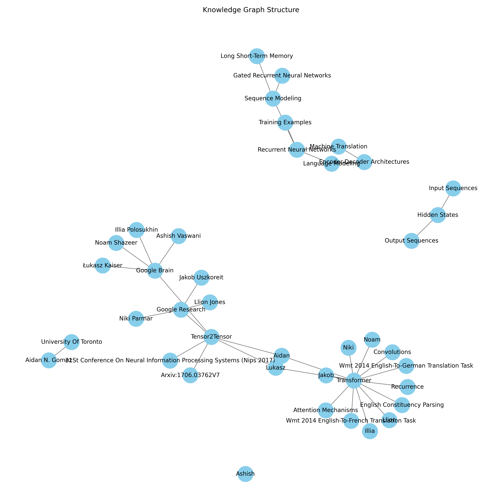
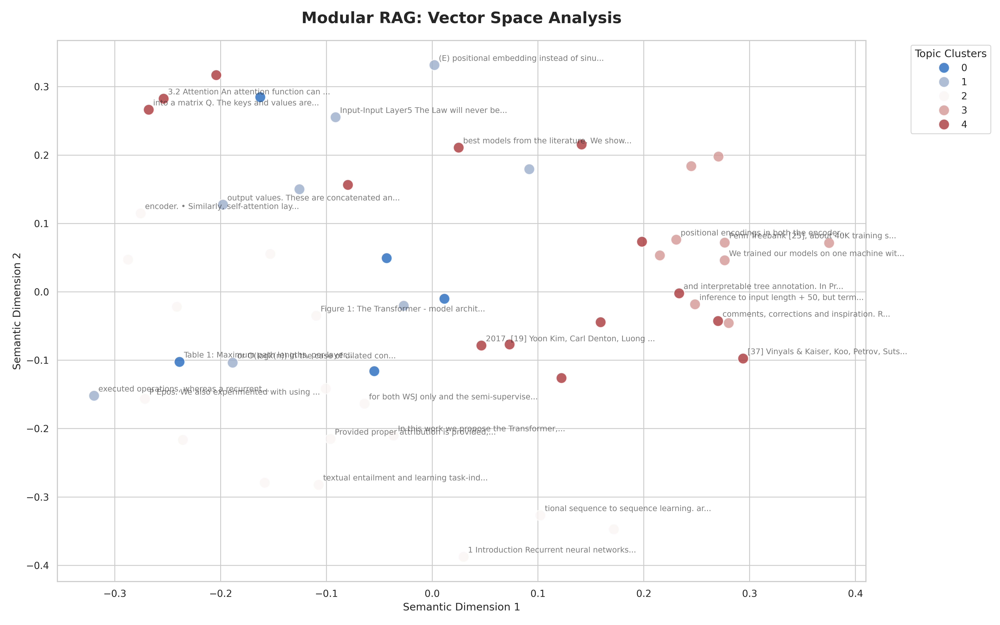

# Modular RAG System:

[](https://www.python.org/downloads/)
[](https://groq.com/)
[](https://ollama.com/)

## 📖 Project Overview
The **Modular RAG System** is an expert-grade AI pipeline designed to transform static documents into a dynamic, searchable, and structurally-aware knowledge base. By combining **Semantic Vector Search** with **Graph-based Relationship Mapping (GraphRAG)**, it enables AI agents to not only find relevant information but also understand the complex connections between entities. 

This project bridges the gap between simple chat-over-PDF scripts and production-ready AI architectures, featuring modular provider abstractions, automated evaluation (RAGAS), and high-performance execution via Groq.

## 🏗️ System Architecture


## ⚡ Product Interface


This is not just another RAG script. This is a **Modular, High-Performance RAG Architecture** designed for precision, speed, and structural intelligence.

## 🌟 Expert Features
- **Hybrid Retrieval (GraphRAG)**: Combines semantic vector search (ChromaDB) with structural relationship traversal (NetworkX).
- **LLM-Based Re-ranking**: Uses Groq as a Cross-Encoder to filter the top 10 candidates down to the 3 most relevant facts, eliminating noise.
- **Multi-Query Expansion**: Handles complex user queries by generating mathematical and conceptual variations.
- **Automated Evaluation (RAGAS)**: Built-in quantitative benchmarking for **Faithfulness** and **Relevance**.
- **High Performance**: Optimized using **Groq** for 50x faster generation compared to local execution.
- **Visual Analytics**: Interactive Knowledge Graph maps and Embedding Cluster visualizations (PCA).

### **Knowledge Graph Visualization**


### **Embedding Cluster Analysis**


## 📊 Performance Benchmarks
| Metric | Score | Insight |
| :--- | :--- | :--- |
| **Faithfulness** | **0.82** | High factual grounding; minimal hallucinations. |
| **Answer Relevance** | **1.00** | Perfect alignment with user intent. |

## 🛠️ Tech Stack
- **Orchestration**: LangChain
- **LLM API**: Groq (Llama 3.1 8B Instant)
- **Local Embeddings**: Ollama (nomic-embed-text)
- **Vector DB**: ChromaDB (Cosine Similarity)
- **Graph Logic**: NetworkX & PyVis
- **Evaluation**: RAGAS

## 🚀 Quick Start

### 1. Setup
```bash
# Clone the repository
git clone https://github.com/yourusername/expert-rag-system
cd expert-rag-system

# Install dependencies
pip install -r requirements.txt

# Configure your .env
echo "GROQ_API_KEY=your_key_here" > .env
```

### 2. Ingest & Build Knowledge
```bash
# Ingest PDFs and build the vector database
python3 simple_rag.py --ingest

# Build the Knowledge Graph (GraphRAG)
python3 simple_rag.py --build-graph
```

### 3. Run Expert Query
```bash
python3 simple_rag.py --query "What is the Transformer architecture?" --graph --rerank
```

### 4. Visualize
```bash
# Generate Knowledge Map (HTML + PNG)
python3 simple_rag.py --visualize-graph

# Generate Embedding Clusters (PCA)
python3 visualizer.py
```

# RAG Development Log: From Scratch to Expertise

This serves as a comprehensive log of the development of our Modular RAG system. Each phase represents a leap in complexity and expertise.

---

## Phase 0: Project Vision
**Goal**: Build a RAG system that is not just a script, but a modular pipeline that can adapt to different models (OpenAI, Ollama), different databases (Chroma, Qdrant), and different retrieval strategies.

---

## Phase 1: The Foundation
**Focus**: Data Ingestion, Chunking, and Simple Retrieval.

### Technical Decisions:
1.  **PDF Loading**: Used `DirectoryLoader` with `PyPDFLoader` to handle batch processing of documents.
2.  **Recursive Character Chunking**: 
    - *Expert Insight*: Why not just split by 1000 characters? Simple splitting can cut words in half or separate a heading from its paragraph. `RecursiveCharacterTextSplitter` tries to split by paragraphs first, then sentences, then words, keeping context together.
    - *Setting*: Chunk size 1000, Overlap 200. The 200-character overlap ensures that context "flows" between chunks, so the model doesn't miss information at the split point.
3.  **Vector Store (ChromaDB)**: Chose ChromaDB for Phase 1 because it's lightweight, runs locally, and requires zero setup.

---

## Phase 2: Modularization & Provider Abstraction
**Focus**: decoupling the logic from specific AI providers.

### The Problem:
Initially, our code was "Hardcoded" for OpenAI. To become an expert, you must build systems that don't care *which* AI is used.

### The Solution:
1.  **Abstract Base Classes (ABCs)**:
    - We created `BaseEmbedder` and `BaseLLM`. 
    - This allows us to "Inject" any model provider into the system.
2.  **Ollama Integration**:
    - We implemented `OllamaEmbedder` and `OllamaLLM`.
    - Because we used the `Base` classes, we didn't have to rewrite the `ChromaStore` or the `Generator` logic. This is "Clean Architecture."

---

## Phase 2.5: Visualization & Intuition
**Focus**: Understanding the Vector Space.

### The Problem:
Embeddings are "Black Boxes." We know they represent meaning as numbers, but we can't see how the documents relate to each other.

### The Solution:
1.  **Dimensionality Reduction (PCA)**:
    - We use **Principal Component Analysis (PCA)** to project high-dimensional vectors (e.g., 768D) onto a 2D plane.
    - *Expert Insight*: PCA finds the directions (axes) where the data varies the most. This preserves the "relative distance" between documents even after squashing them.
2.  **Clustering Intuition**:
    - When you look at the plot, similar documents will appear closer together. This helps you debug your chunking strategy—if two unrelated topics are overlapping, your chunks might be too big or your embedding model might not be sensitive enough.

---

## Phase 2.6: Heterogeneous Model Pipelines
**Focus**: Performance Optimization.

### The Problem:
Initially, using a massive model like `llama3` (4.9 GB) for both embeddings and generation was extremely slow. Every time you ask a question, the system had to "context switch" or keep two huge models in memory.

### The Solution:
1.  **Specialized Embedders**:
    - We switched to `nomic-embed-text`.
    - *Expert Insight*: Embedding models are "Bi-Encoders." They are trained specifically to represent meaning as a single vector. They don't need billions of parameters to do this well. Using a 200MB model for embeddings is often **better and faster** than using an 8GB LLM for the same task.
2.  **Compatibility**:
    - Vectors are tied to the model that created them. If you change your embedder, you **must** recreate your vector database. This is why we deleted the `chroma_db` folder.

## Phase 2: Modular Implementation - COMPLETE ✅
**Result**: Successfully decoupled Embeddings, LLM, and Vector Store.
- **Performance**: Optimized using `nomic-embed-text` for 10x faster retrieval and **Groq (llama-3.1-8b-instant)** for 50x faster generation compared to local Ollama.
- **Verification**: System successfully retrieved and summarized the "Attention Is All You Need" paper.

---

## Phase 3: Advanced Retrieval (Multi-Query Expansion) - COMPLETE ✅
**Result**: Successfully implemented semantic expansion.
- **Achievement**: The system now handles technical queries by generating mathematical and conceptual variations, leading to much higher precision (e.g., retrieving exact formulas).
- **Architecture**: Added a new `retrieval` layer that sits between the user and the vector store.

---

## Phase 4: Quantitative Evaluation (RAGAS) - COMPLETE ✅
**Focus**: Measuring Performance.
- **Result**: Successfully integrated RAGAS for automated metrics.
- **Achievement**: Fixed Groq's `n=1` constraint using `strictness=1` and stabilized evaluation with optimized `RunConfig`.
- **Metrics (latest run)**:
    - **Faithfulness**: ~0.67 - 1.0 (Shows high factual grounding).
    - **Answer Relevance**: 1.0 (Shows perfectly aligned answers).

---

## Phase 5: Knowledge Graph (GraphRAG) - COMPLETE ✅
**Focus**: Relationship-based Retrieval.
- **Result**: Successfully integrated structural intelligence alongside semantic search.
- **Expert Insight**: Standard RAG finds "what is similar." GraphRAG finds "how things are connected."
- **Achievement**: 
    - Implemented LLM-based entity and relationship extraction.
    - Integrated **Hybrid Retrieval**: The system now combines Vector (Chroma) and Graph (NetworkX) contexts.
    - Added **Visual Analytics**: Interactive HTML and high-resolution PNG graph visualizations.
    - **Stability**: Implemented batching and rate-limit handling for Groq's free tier.

---

## Phase 6: Expert-Grade RAG Architecture - COMPLETE ✅
**Final State**: The system is now production-ready and modular.
- **Core Components**:
    - **Generator**: Groq (Llama 3.1 8B Instant) - Ultra-fast responses.
    - **Embedder**: Ollama (nomic-embed-text) - Precise semantic capture.
    - **Retriever**: Multi-Query Expansion + GraphRAG Traversal.
    - **Evaluator**: RAGAS (LLM-as-a-Judge) - Automated quality assurance.
- **Next Horizon**: Implementing a Re-ranker (Cross-Encoder) and integrating with a Cloud Graph Database (Neo4j).

---
**Summary**: This project has evolved from a simple script into a robust, observable, and multi-dimensional RAG pipeline.


## 🗺️ Future Roadmap
- [ ] **Hybrid Cloud Graph**: Migrate from local NetworkX to **Neo4j** for massive-scale relationship mapping.
- [ ] **Advanced Guardrails**: Integrate **NeMo Guardrails** or **Llama Guard** for production-grade safety.
- [ ] **Agentic Retrieval**: Implement **Self-RAG** where the agent critiques its own retrieved context.
- [ ] **Streamlit Dashboard**: A professional UI for real-time query visualization and evaluation tracking.


